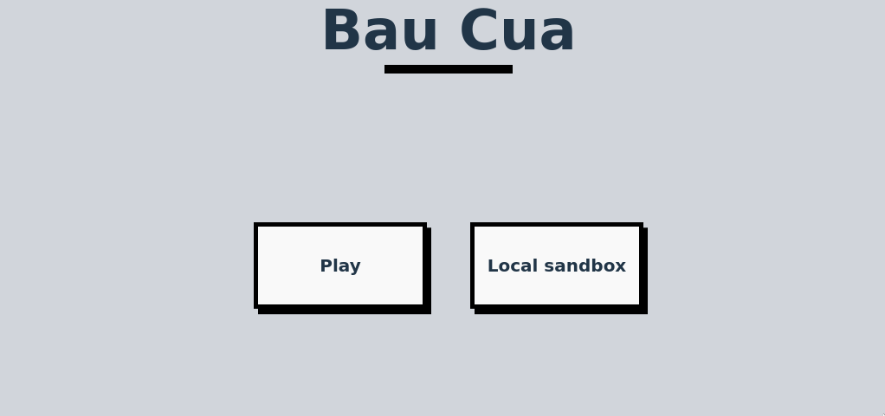
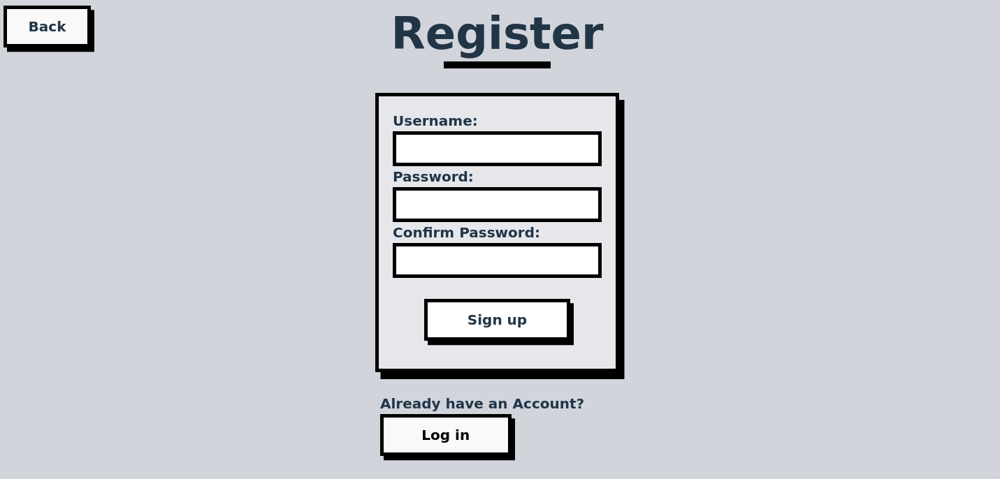
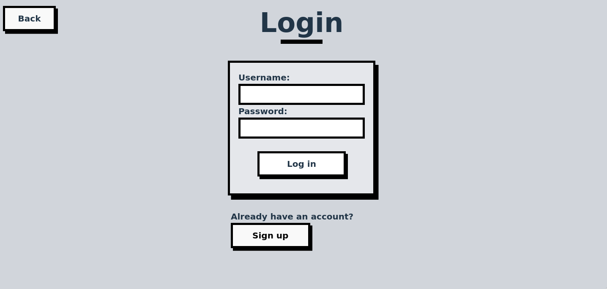
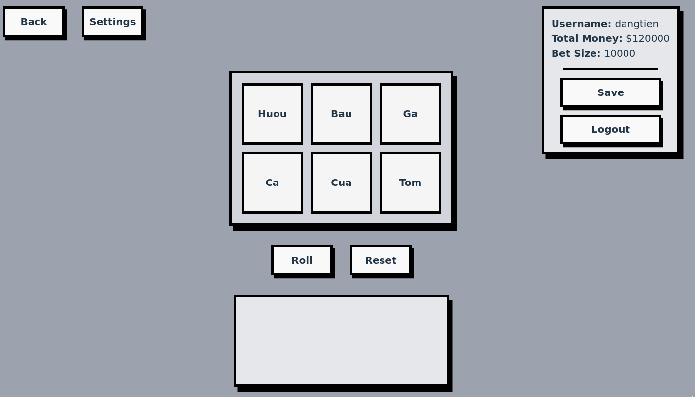
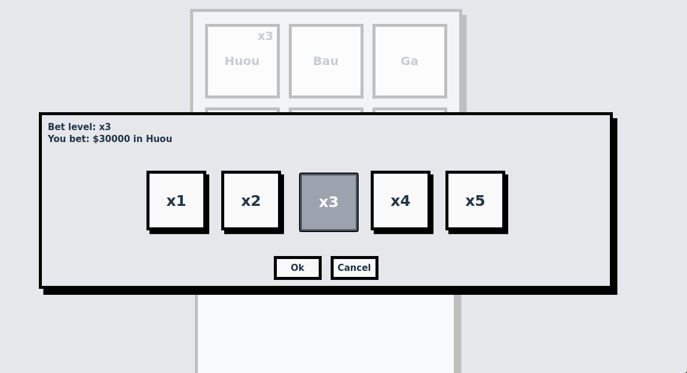
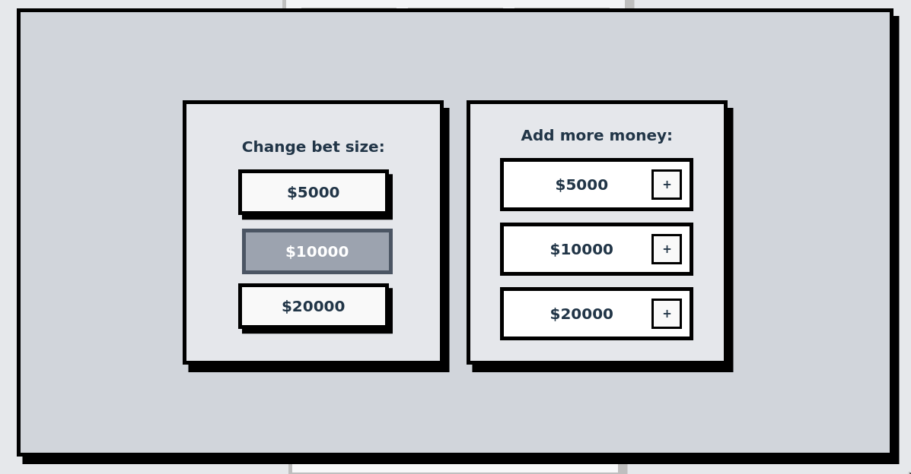
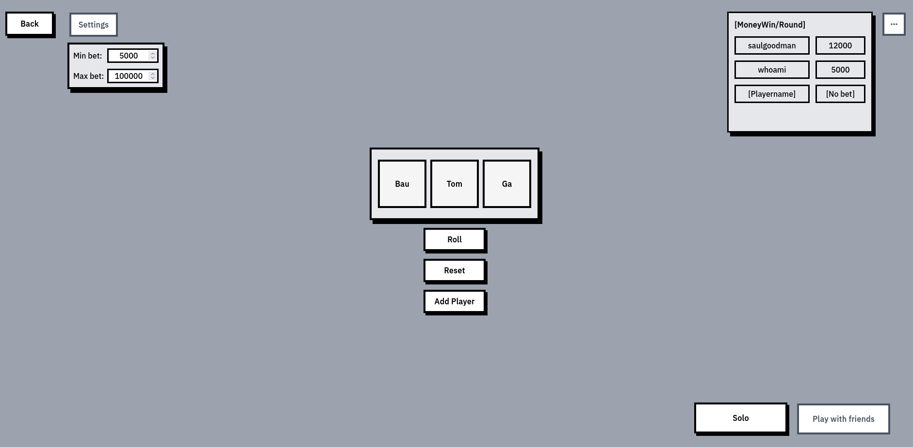
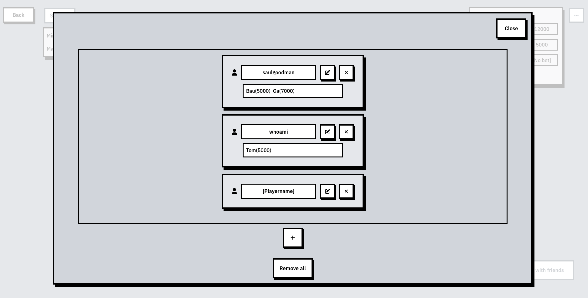

# bau-cua-reactjs

A simple Bau Cua game made with ReactJS.\
React Login Authentication with JWT.\
REST API with MongoDB.

## Images

**Home Page**

---

**Forms**

---

**Ingame**

    *Right click to open this*

---

**PlayWithFriends Mode (Only in LocalSandbox)**

